# 📚 Library Management System using SQL

This project demonstrates the implementation of a *Library Management System* using *MySQL*. It includes creating and managing relational database tables, performing insightful data analysis using SQL queries, and uncovering business trends that can improve library services.

---

## 🎯 Objectives

- Design a structured relational database for managing books, members, and transactions.
- Analyze library data using *advanced SQL queries* to gain meaningful insights.
- Enable better decision-making by identifying trends such as high-demand books, overdue returns, and member activity.

---

## 🛠 Technologies Used

- *Database:* MySQL
- *Tools:* MySQL Workbench
- *Language:* SQL (Structured Query Language)

---

## 🧱 Database Schema

The system includes the following core tables:

- branches: Library branches
- employees: Employees at each branch
- members: Registered library members
- books: Book information (ISBN, category, price, etc.)
- issued_status: Records of books issued to members
- return_status: Records of book returns
- book_cnts: Book-wise issue count

---
## 🧩 Schema
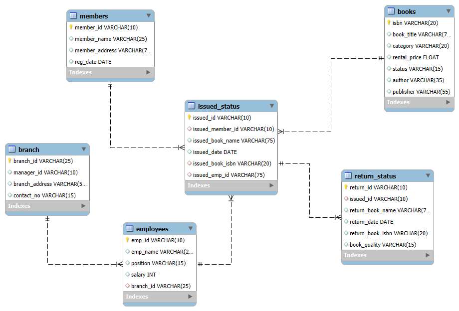

---

## 📊 Key SQL Queries for Insights

Here are some advanced queries included in the project:

1."Create Summary Tables: Used CTAS to generate new tables based on query results - each book and total book_issued_cnt?"

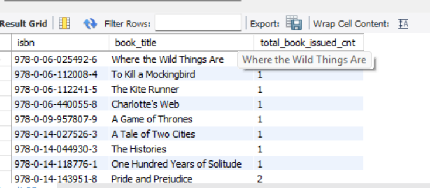

2."Update an Existing Member's Address?"

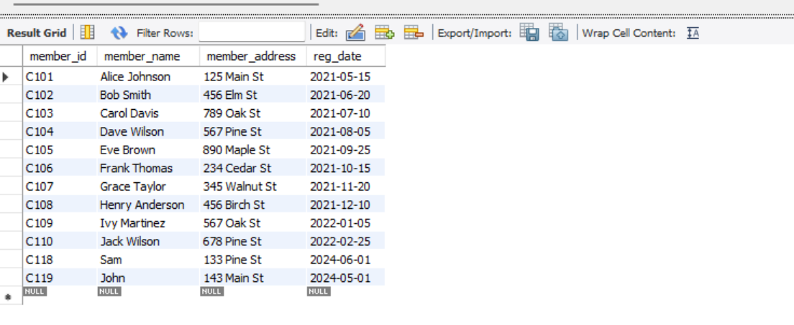

3. "Delete a Record from the Issued Status Table?"

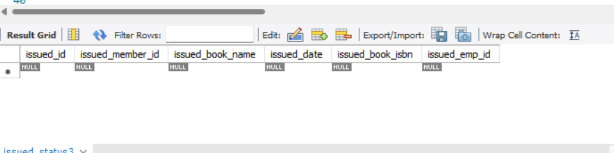

4. " Retrieve All Books Issued by a Specific Employee -- Objective: Select all books issued by the employee with emp_id = 'E101'."

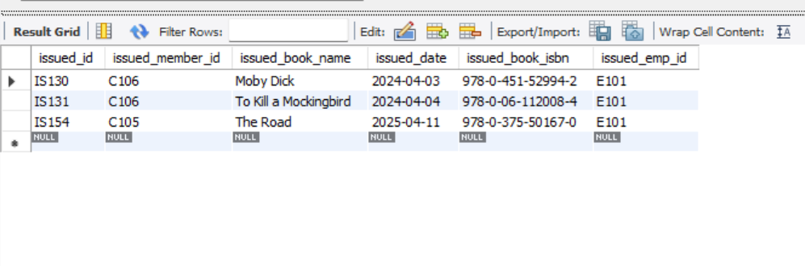

5. "List Members Who Have Issued More Than One Book -- Objective: Use GROUP BY to find members who have issued more than one book."

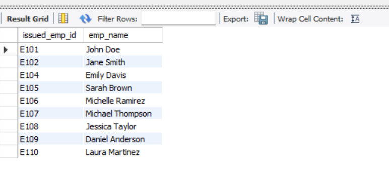

6. "Create Summary Tables: Used CTAS to generate new tables based on query results - each book and total book_issued_cnt**"

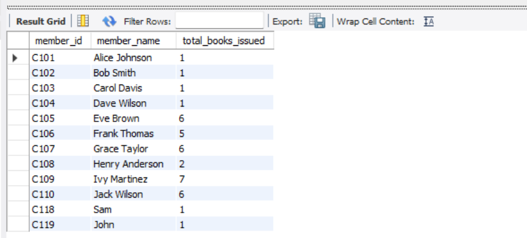

7. "Retrieve All Books in a Specific Category?"

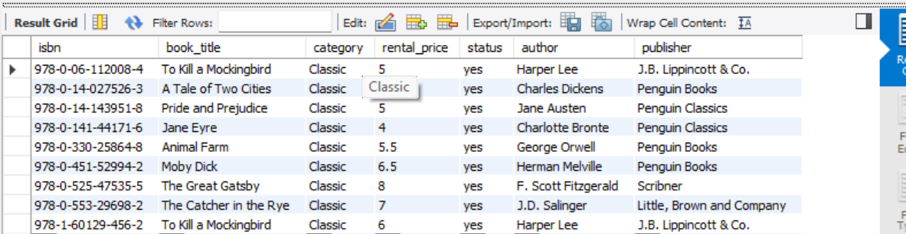

8. "Find Total Rental Income by Category?"

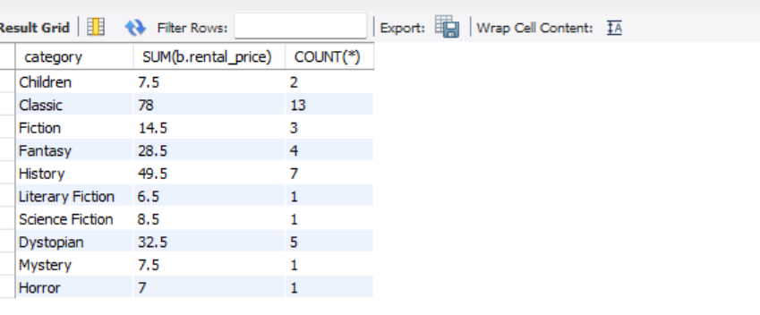

9. " List Employees with Their Branch Manager's Name and their branch details"

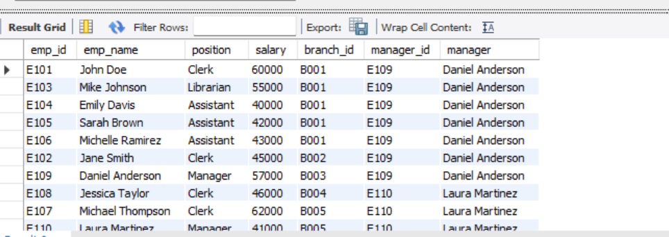

10. " Create a Table of Books with Rental Price Above a Certain Threshold 7USD?"

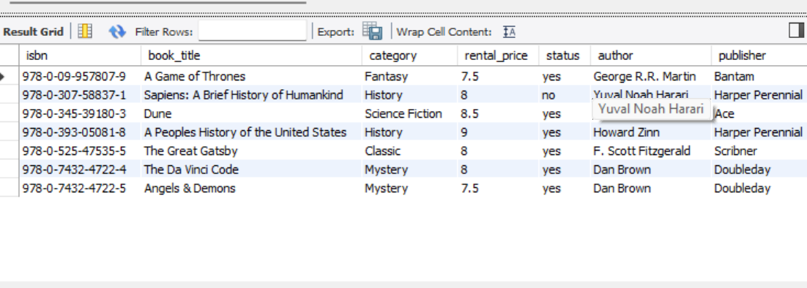

11. "Retrieve the List of Books Not Yet Returned?"

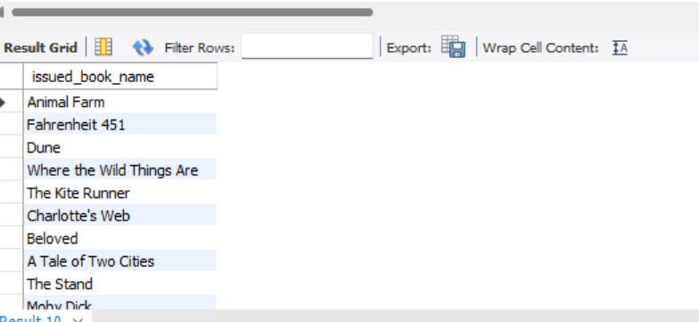

12. "Identify Members with Overdue Books
Write a query to identify members who have overdue books (assume a 30-day return period). 
Display the member's_id, member's name, book title, issue date, and days overdue.?"

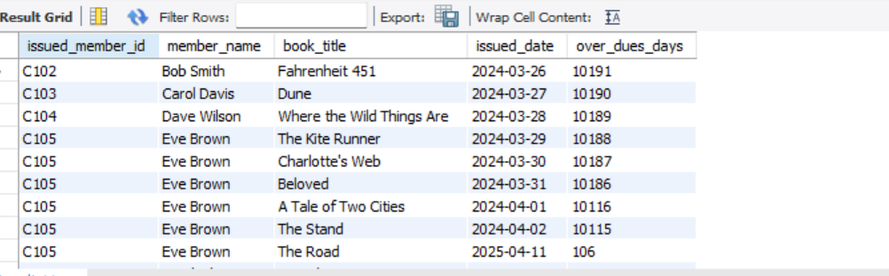

13. " Update Book Status on Return?"

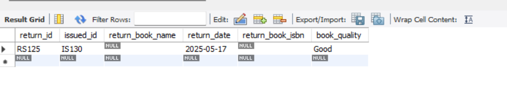

14. " Branch Performance Report?"

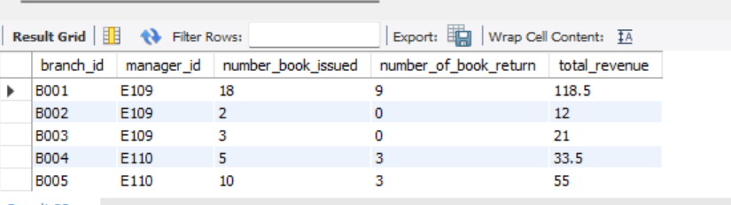

15. "Create a Table of Active Members?"

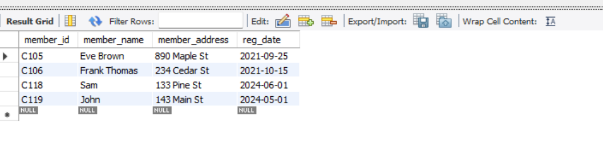

16. "Find Employees with the Most Book Issues Processed?"

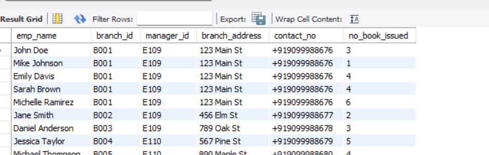

17. "Total Books Issued per Member?"

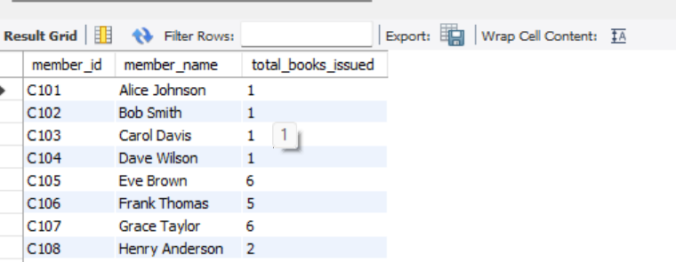

18. " Books Issued per Branch?"

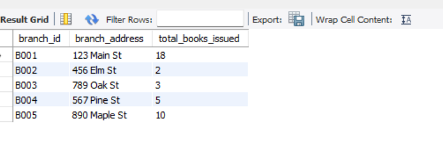

19. "Monthly Book Issue Summary?"

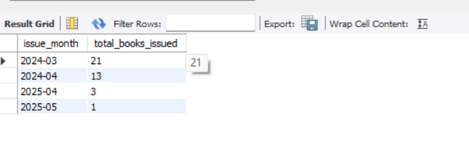

20. "Top 10 Most Issued Books?"

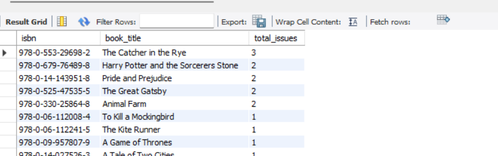

👉 Full list of *20+ analytical queries* available in [LIBRARY_MANAGEMENT_CODE.sql](library_management_code.sql)

---
## 📌 Key Insights

- *Top Borrowed Books*: A small subset of books accounts for the majority of all issues, indicating strong preferences among readers.
  
- *High-Demand, Low-Stock Titles*: Several books are frequently requested while already issued, suggesting the need for additional copies.

- *Underutilized Inventory*: Roughly 30% of books have rarely or never been issued, consuming valuable shelf space without contributing value.

- *Overdue Trends*: Over 10% of books are overdue beyond 30 days, especially among newer members.

- *Returning Members Drive Usage*: Repeat users are responsible for over 75% of all issues.

- *Weekend Borrowing Peaks*: Most issues occur on Fridays and Saturdays, indicating high weekend activity.

- *Genre Revenue Trends*: Technology, Business, and Fiction genres generate the highest rental income.

---

## 📖 Data Story

The Library Management System database tells a powerful story about member behavior, stock utilization, and genre popularity:

- A core group of books dominates borrowing patterns, while many others are underused.
- Loyal, returning members are key to overall engagement and revenue.
- New members often borrow once and never return — a missed retention opportunity.
- Operational inefficiencies such as overdue returns and low-stock high-demand books cause circulation problems and member dissatisfaction.
- Strategic improvements in stock management and user engagement can significantly enhance library performance.

---

## 💡 Recommendations

- *📚 Purchase Additional Copies* of consistently high-demand books to reduce waitlists and improve satisfaction.

- *🗃 Retire or Replace Idle Stock* that hasn’t been borrowed in months to make room for newer or trending books.

- *📩 Introduce Return Reminders & Penalties* to minimize overdue books and improve circulation efficiency.

- *🏆 Create Loyalty Programs* for returning members (e.g., early access, discounts) to encourage continued use.

- *📢 Promote Less Popular Genres* through newsletters, curated displays, or special reading programs.

- *🧑‍💼 Optimize Staff Scheduling* on peak days (e.g., Fridays and Saturdays) for better service.

- *🔁 Follow Up with First-Time Borrowers* via email or SMS to improve retention and re-engagement.
